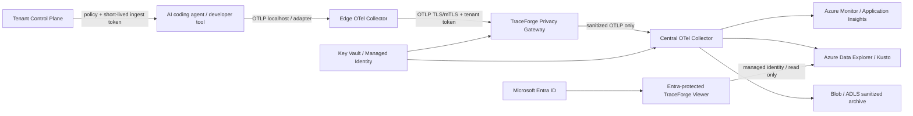

# TraceForge architecture

## Goal

TraceForge is a privacy-first telemetry pipeline for AI coding agents and developer tools. Raw developer telemetry is treated as sensitive by default. The system scrubs secrets and personally identifiable information before data enters centralized durable storage.

## Trust boundaries

1. **Developer endpoint**: highest sensitivity. Raw prompts, code fragments, shell arguments, paths, tokens, cookies, and credentials may appear here.
2. **Edge collector**: local OpenTelemetry receiver and batching layer. It only listens on loopback by default.
3. **Privacy gateway**: mandatory boundary where policy, secret detection, tokenization, and redaction are enforced.
4. **Central telemetry plane**: sanitized telemetry only.
5. **Tenant control plane**: organization lifecycle, policy delivery, scoped API-key authentication, and short-lived ingest-token issuance.
6. **Viewer and query plane**: read-only access for authenticated users through Microsoft Entra ID and a dedicated query identity.

## Target data path



In the hardened Azure profile, the Container Apps environment is attached to a dedicated VNet. Key Vault, Storage Blob/DFS, and optional ADX are reached through Azure Private Endpoints and linked Private DNS zones while their public data-plane network access is disabled.

## Design principles

- **Privacy before persistence**: durable centralized storage must never receive raw sensitive payloads.
- **OTLP first**: use OpenTelemetry Protocol at component boundaries to avoid vendor lock-in.
- **Fail closed for privacy**: malformed or unclassified sensitive fields must not bypass policy silently.
- **No raw prompt or source capture by default**: prompt, completion, source content, request bodies, response bodies, and database statements are dropped unless an explicit policy enables a safer derived representation.
- **Stable correlation without plaintext**: optional HMAC tokenization allows equality correlation while hiding the original value.
- **Least privilege**: ingestion identities cannot query by default; viewer identities receive query-only database permissions and do not mutate ingestion policy.
- **Authenticated tenancy over claimed tenancy**: the gateway verifies a signed tenant token and overwrites any organization ID supplied by an endpoint before centralized persistence.
- **Private PaaS dependencies**: production mode can remove public data-plane reachability for Key Vault, ADLS, and ADX while keeping only the intended gateway/viewer application surfaces exposed.
- **Portable core, Azure production profile**: the privacy core and OTLP pipeline remain portable, while the reference production deployment targets Azure Container Apps, Azure Monitor, ADX/Kusto, Blob/ADLS, Key Vault, Entra ID, VNet integration, and Azure Private Link.

## Local reference profile

The local Docker Compose profile is the fully working M0-M4 reference implementation:

```text
synthetic agent / OTLP client
          |
          v
privacy gateway
          |
          v
central collector
          |
          v
SQLite WAL trace store
          |
          v
searchable read-only API + timeline viewer + JSONL export
```

The trace store scrubs again at ingress as defense in depth. Privacy findings are persisted only as aggregate counters tied to an opaque export ID; matched secret values are not stored.

## Azure production profile

M5 is implemented in `deploy/azure/main.bicep` as an opt-in production profile.

The Azure slice can deploy:

- Azure Container Apps environment
- external HTTP/2 TraceForge privacy gateway
- internal OpenTelemetry Collector
- separate user-assigned identities for gateway, collector, and optional production viewer
- RBAC-enabled Key Vault with purge protection
- Log Analytics and workspace-based Application Insights
- ADLS Gen2 containers for sanitized archives
- optional Azure Data Explorer cluster/database/table schema
- database-level ADX `Ingestor` role for the collector identity
- ADX-backed TraceForge viewer Container App when ADX, viewer image, and Entra client ID are supplied
- database-level ADX `Viewer` role for the viewer identity
- Container Apps built-in Microsoft Entra authentication on the production viewer
- optional dedicated VNet and delegated Container Apps infrastructure subnet
- dedicated private-endpoint subnet
- linked Azure Private DNS zones
- Private Endpoints for Key Vault, Storage Blob/DFS, and optional ADX

The collector image is pinned to OpenTelemetry Collector Contrib and can select one of four profiles at deployment time: Azure Monitor only, Azure Monitor plus Blob archive, Azure Monitor plus ADX, or Azure Monitor plus ADX plus Blob archive.

ADX is opt-in because of cost. Blob archival is also opt-in because the upstream OpenTelemetry Azure Blob exporter is still alpha. The production baseline therefore starts with Application Insights and adds the other sinks explicitly.

### Azure network topology

With `enableVnetIntegration=true`, the Container Apps environment uses the delegated `aca-infrastructure` subnet. The separate `private-endpoints` subnet is reserved for Azure Private Link.

With both `enableVnetIntegration=true` and `enablePrivateEndpoints=true`:

- Key Vault public network access is disabled and its `vault` Private Endpoint is mapped through `privatelink.vaultcore.azure.net`.
- ADLS public network access is disabled and both `blob` and `dfs` endpoints are private.
- ADX public network access is disabled when ADX is deployed. Its `cluster` Private Endpoint is associated with the regional Kusto zone plus the Blob, Queue, and Table zones required by ADX Private Link.
- Container Apps waits for the private endpoint module before starting gateway, collector, or viewer revisions that depend on those resources.

The privacy gateway remains externally reachable because it is the product's intended OTLP ingestion surface. The production viewer also retains external HTTPS ingress, but Container Apps built-in authentication redirects unauthenticated users to Microsoft Entra ID before application traffic is served. The central collector remains internal-only.

## Components

### Edge agent

OpenTelemetry Collector Contrib and/or TraceForge adapters run on developer machines. The adapter layer currently normalizes GitHub Copilot hook events, Claude Code stream JSON, Codex JSON Lines, and a generic JSON/JSONL contract while intentionally excluding raw prompts, commands, tool payloads, and assistant text.

### Privacy gateway

Python service that terminates OTLP, verifies optional or required short-lived tenant ingest tokens, recursively scrubs resource/span/event attributes, drops prohibited content fields, detects known credential formats and high-entropy tokens, optionally tokenizes selected values, overwrites tenant identity from authenticated claims, then forwards sanitized telemetry.

### Tenant control plane

The M7 reference control plane manages organizations, effective capture policy, scoped API keys,
revocation, and short-lived signed ingest tokens. API-key plaintext is never stored. Endpoint
adapters use the API key only with the control plane; the OTLP gateway receives a short-lived token
instead.

The gateway verifies signature, expiration, issuer, and the ingest scope. It then replaces any
client-supplied organization attribute with the authenticated organization ID. This creates a
tenant boundary that does not trust endpoint telemetry labels.

The reference registry uses SQLite WAL for one durable control-plane instance. The token contract
and gateway enforcement are persistence-backend independent.

### Central collector

A second OTel Collector performs batching, retry, routing, and export. In Azure it runs as an internal-only Container App and exports only data that has already crossed the privacy boundary.

### Storage and analytics

- Azure Monitor / Application Insights for operational trace exploration.
- Azure Data Explorer for high-volume task -> session -> trace analytics and KQL when enabled.
- Blob / ADLS Gen2 for sanitized long-term archives when explicitly enabled.
- SQLite WAL only for the local reference viewer, not as the long-term Azure production query store.

### Viewer

The local viewer is read-only and backed by the SQLite reference repository. The Azure production viewer uses `KustoTraceRepository` against the `OTELTraces` table and keeps the existing viewer API/UI contract.

User-controlled search values are sent to ADX through Kusto query parameters instead of being concatenated into KQL. The viewer process authenticates to ADX with its own user-assigned managed identity, which receives only the database-level `Viewer` role. Browser access is protected separately at the Container Apps edge using built-in Microsoft Entra authentication with unauthenticated requests redirected to sign-in.

This separation keeps human authentication, application query authorization, and telemetry ingestion authorization as distinct controls.

## Current milestone

M0-M4 are complete in the reference stack. M5 now includes Azure IaC, Container Apps gateway/collector/viewer, separate managed identities, Key Vault, Azure Monitor, optional ADX ingestion, optional sanitized Blob archive, ADX-backed viewer queries, Microsoft Entra protection, VNet integration, Private DNS, Private Endpoints, and public-network shutdown for sensitive PaaS dependencies when private mode is selected.

The remaining M5 item is live subscription validation of deployment, DNS, Entra callback behavior, managed-identity access, end-to-end sanitized telemetry flow, and rollback/redeployment behavior. M6 security/reliability work is complete. M7 reference productization is complete with vendor adapters, organization policy controls, the multi-tenant control plane, self-hosted product packaging, and versioned release handoff tooling.
