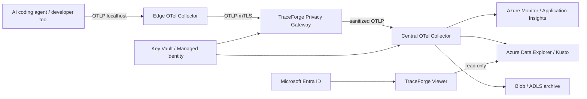

# TraceForge architecture

## Goal

TraceForge is a privacy-first telemetry pipeline for AI coding agents and developer tools. Raw developer telemetry is treated as sensitive by default. The system must scrub secrets and personally identifiable information before data enters centralized durable storage.

## Trust boundaries

1. **Developer endpoint**: highest sensitivity. Raw prompts, code fragments, shell arguments, paths, tokens, cookies, and credentials may appear here.
2. **Edge collector**: local OpenTelemetry receiver and batching layer. It only listens on loopback by default.
3. **Privacy gateway**: mandatory boundary where policy, secret detection, tokenization, and redaction are enforced.
4. **Central telemetry plane**: sanitized telemetry only.
5. **Viewer and query plane**: read-only access for authorized users with audit logging.

## Target data path

## Design principles

- **Privacy before persistence**: durable centralized storage must never receive raw sensitive payloads.
- **OTLP first**: use OpenTelemetry Protocol at component boundaries to avoid vendor lock-in.
- **Fail closed for privacy**: malformed or unclassified sensitive fields must not bypass policy silently.
- **No raw prompt or source capture by default**: prompt, completion, source content, request bodies, response bodies, and database statements are dropped unless an explicit policy enables a safer derived representation.
- **Stable correlation without plaintext**: optional HMAC tokenization allows equality correlation while hiding the original value.
- **Least privilege**: viewer is read-only; ingestion identities cannot query; query identities cannot mutate collection policy.
- **Portable core, Azure production profile**: the privacy core and OTLP pipeline remain portable, while the reference production deployment targets Azure Container Apps, Azure Monitor, ADX/Kusto, Blob/ADLS, Key Vault, and Entra ID.

## Component roadmap

### Edge agent

OpenTelemetry Collector Contrib on developer machines. Receives OTLP on loopback, enriches resource metadata, batches, and forwards to the privacy gateway. Future adapters will cover GitHub Copilot CLI, Claude Code, Codex, and generic command wrappers.

### Privacy gateway

Python service that terminates OTLP, recursively scrubs resource/span/event attributes, drops prohibited content fields, detects known credential formats and high-entropy tokens, optionally tokenizes selected values, then forwards sanitized telemetry.

### Central collector

A second OTel Collector performs batching, retry, routing, sampling, and export. This separation keeps privacy policy independent from backend selection.

### Storage

- Azure Monitor / Application Insights for operational trace exploration.
- Azure Data Explorer for high-volume task -> session -> trace analytics and custom KQL.
- Blob or ADLS for sanitized long-term export and replay datasets when enabled.

### Viewer

Read-only web application with task -> session -> trace correlation, span timeline, scrub findings summary, and policy-safe metadata. Entra ID protects access in the Azure profile.

## Current milestone

Milestone 1 implements and tests the privacy kernel plus the initial edge collector configuration. OTLP proxying, Azure resources, and the viewer follow in later milestones.
