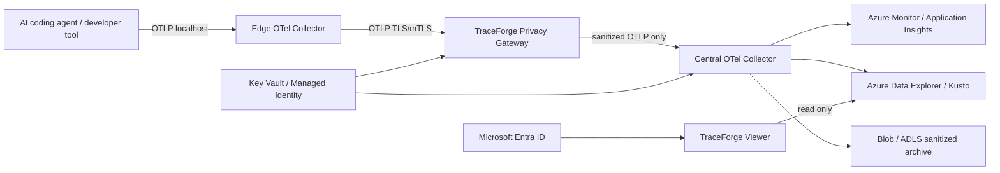

# TraceForge architecture

## Goal

TraceForge is a privacy-first telemetry pipeline for AI coding agents and developer tools. Raw developer telemetry is treated as sensitive by default. The system scrubs secrets and personally identifiable information before data enters centralized durable storage.

## Trust boundaries

1. **Developer endpoint**: highest sensitivity. Raw prompts, code fragments, shell arguments, paths, tokens, cookies, and credentials may appear here.
2. **Edge collector**: local OpenTelemetry receiver and batching layer. It only listens on loopback by default.
3. **Privacy gateway**: mandatory boundary where policy, secret detection, tokenization, and redaction are enforced.
4. **Central telemetry plane**: sanitized telemetry only.
5. **Viewer and query plane**: read-only access for authorized users with audit logging.

## Target data path



## Design principles

- **Privacy before persistence**: durable centralized storage must never receive raw sensitive payloads.
- **OTLP first**: use OpenTelemetry Protocol at component boundaries to avoid vendor lock-in.
- **Fail closed for privacy**: malformed or unclassified sensitive fields must not bypass policy silently.
- **No raw prompt or source capture by default**: prompt, completion, source content, request bodies, response bodies, and database statements are dropped unless an explicit policy enables a safer derived representation.
- **Stable correlation without plaintext**: optional HMAC tokenization allows equality correlation while hiding the original value.
- **Least privilege**: ingestion identities cannot query by default; query identities should not mutate collection policy.
- **Portable core, Azure production profile**: the privacy core and OTLP pipeline remain portable, while the reference production deployment targets Azure Container Apps, Azure Monitor, ADX/Kusto, Blob/ADLS, Key Vault, and Entra ID.

## Local reference profile

The local Docker Compose profile is the fully working M0-M4 reference implementation:

```text
synthetic agent / OTLP client
          |
          v
privacy gateway
          |
          v
central collector
          |
          v
SQLite WAL trace store
          |
          v
searchable read-only API + timeline viewer + JSONL export
```

The trace store scrubs again at ingress as defense in depth. Privacy findings are persisted only as aggregate counters tied to an opaque export ID; matched secret values are not stored.

## Azure production profile

M5 now has an infrastructure foundation in `deploy/azure/main.bicep`.

The first Azure slice deploys:

- Azure Container Apps environment
- external HTTP/2 TraceForge privacy gateway
- internal OpenTelemetry Collector
- separate user-assigned managed identities
- RBAC-enabled Key Vault with purge protection
- Log Analytics and workspace-based Application Insights
- ADLS Gen2 containers for sanitized archives
- optional Azure Data Explorer cluster/database/table schema
- database-level ADX `Ingestor` role for the collector identity

The collector image is pinned to OpenTelemetry Collector Contrib and can select one of four profiles at deployment time: Azure Monitor only, Azure Monitor plus Blob archive, Azure Monitor plus ADX, or Azure Monitor plus ADX plus Blob archive.

ADX is opt-in because of cost. Blob archival is also opt-in because the upstream OpenTelemetry Azure Blob exporter is still alpha. The production baseline therefore starts with Application Insights and adds the other sinks explicitly.

The current Azure networking slice keeps service public endpoints enabled while requiring TLS and RBAC. Private endpoints and VNet hardening remain an explicit M5 security task rather than being implied by the template.

## Components

### Edge agent

OpenTelemetry Collector Contrib on developer machines. Receives OTLP on loopback, enriches resource metadata, batches, and forwards to the privacy gateway. Future adapters will cover GitHub Copilot CLI, Claude Code, Codex, and generic command wrappers.

### Privacy gateway

Python service that terminates OTLP, recursively scrubs resource/span/event attributes, drops prohibited content fields, detects known credential formats and high-entropy tokens, optionally tokenizes selected values, then forwards sanitized telemetry.

### Central collector

A second OTel Collector performs batching, retry, routing, and export. In Azure it runs as an internal-only Container App and exports only data that has already crossed the privacy boundary.

### Storage and analytics

- Azure Monitor / Application Insights for operational trace exploration.
- Azure Data Explorer for high-volume task -> session -> trace analytics and KQL when enabled.
- Blob / ADLS Gen2 for sanitized long-term archives when explicitly enabled.
- SQLite WAL only for the local reference viewer, not as the long-term Azure production query store.

### Viewer

The local viewer is read-only and backed by the SQLite reference repository. The production viewer will replace that repository with ADX queries and then enable Container Apps built-in Microsoft Entra authentication. Until that adapter lands, Azure operators use Application Insights or ADX directly instead of presenting the local SQLite viewer as production-ready.

## Current milestone

M0-M4 are complete in the reference stack. M5 is in progress: the Azure IaC, Container Apps runtime path, managed identities, Key Vault, Azure Monitor, optional ADX, and optional sanitized Blob archive are implemented. Remaining M5 work is the ADX-backed viewer, Entra protection for that viewer, private networking, and live subscription deployment validation.
